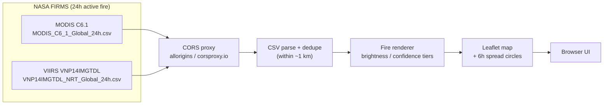

# 🔥 FireSight

**Turn NASA's live satellite fire-detection feeds into an interactive wildfire map you can explore in the browser — no build step, no API key, no backend.**

[](LICENSE)
[](https://firms.modaps.eosdis.nasa.gov/)
[](https://leafletjs.com/)

[Quick start](#quick-start) · [Data sources](#data-sources) · [How it works](#how-it-works) · [Spread model](#spread-model) · [Limitations](#limitations) · [Roadmap](#roadmap)

FireSight pulls the last 24 hours of active-fire detections from NASA FIRMS directly in the browser, plots them on a Leaflet map with intensity-coded markers, and draws a rough 6-hour spread estimate around each hotspot. It was built as a hackathon project; the goal was a zero-setup way for a non-technical user to see current global fire activity and click any hotspot for detail.


```mermaid
graph LR
    subgraph FIRMS["NASA FIRMS (24h active fire)"]
      M["MODIS C6.1<br/>MODIS_C6_1_Global_24h.csv"]
      V["VIIRS VNP14IMGTDL<br/>VNP14IMGTDL_NRT_Global_24h.csv"]
    end
    M --> P["CORS proxy<br/>allorigins / corsproxy.io"]
    V --> P
    P --> C["CSV parse + dedupe<br/>(within ~1 km)"]
    C --> R["Fire renderer<br/>brightness / confidence tiers"]
    R --> L["Leaflet map<br/>+ 6h spread circles"]
    L --> U["Browser UI"]
```

## Quick start

No build step and no dependencies — a static file server is all you need.

```bash
git clone https://github.com/zelinewang/FireSight.git
cd FireSight
python3 -m http.server 8000
# then open http://localhost:8000/src/ and click "Update" to pull the latest detections
```

*Verified: `python3 -m http.server` serves `/src/` with HTTP 200 (`<title>FireSight - Real-Time Wildfire Intelligence</title>`). Any static host works too — `netlify.toml` publishes `src/` with no build command.*

## Data sources

Everything is fetched client-side; there is no server and no API key.

| Source | Feed | Notes |
|---|---|---|
| NASA FIRMS — MODIS C6.1 | `MODIS_C6_1_Global_24h.csv` | Global active-fire detections, last 24h |
| NASA FIRMS — VIIRS (VNP14IMGTDL NRT) | `VNP14IMGTDL_NRT_Global_24h.csv` | Higher-resolution near-real-time detections |
| CORS proxy | `allorigins.win`, `corsproxy.io` | FIRMS CSV endpoints don't send CORS headers, so requests are proxied from the browser |
| Map | [Leaflet](https://leafletjs.com/) via unpkg | Tiles, markers, and spread circles |

The Python scripts under `scripts/` (e.g. `fetch_firms_data.py`) are optional offline helpers for pulling the same FIRMS CSVs outside the browser; the web app does not depend on them.

## How it works

1. On "Update", the browser requests the MODIS and VIIRS 24h CSVs through a CORS proxy (with fallbacks if one proxy is down).
2. Rows are parsed, deduplicated within ~1 km, and tiered by brightness/confidence into high/medium/low markers.
3. Each hotspot gets a 6-hour spread circle from the [heuristic](#spread-model) below.
4. Leaflet renders the markers, circles, and click-through info panels; state is cached in `localStorage` for instant reloads.

A more detailed system diagram — including components that are **designed but not yet wired** (e.g. an Open-Meteo wind feed) — lives at [`diagrams/current_system_architecture.svg`](diagrams/current_system_architecture.svg). The Mermaid diagram above reflects what the current build actually does.

## Spread model

The 6-hour spread radius is a deliberately simple heuristic, not a physical fire model:

```
base            = 3.0 km
+ brightness    : >350K → +3.0 km,  >320K → +1.5 km
+ confidence    : high → +1.0 km,   low → -1.0 km
+ wind          : client-side random variation of ±2.0 km
radius          = clamp(1.0 km, 15.0 km)
```

Wind is a random variation term, **not** measured meteorology — `src/app.js` is explicit about this (`// simplified - no external wind API for now`). Treat the circles as a rough visual cue, not an operational forecast.

## Limitations

- **Hackathon build** (~12 commits), client-side only, no persistence or accounts.
- **Depends on third-party public CORS proxies.** If they rate-limit or go down, data stops loading — this is the most common failure mode.
- **Spread prediction is illustrative**, from the heuristic above; it is not validated against real fire behavior and uses no terrain, fuel, or measured wind.
- **No automated test suite.** `tests/` contains manual HTML debug pages, not CI tests.
- Coverage/latency are bounded by the FIRMS NRT feeds (typically a few hours behind detection).

## Roadmap

Ideas, not yet built — listed honestly so the current scope is clear:

- Wire a real wind feed (Open-Meteo is already stubbed in the docs) into the spread term.
- Add terrain/fuel inputs and replace the heuristic with a published spread model (e.g. Rothermel).
- Add a small backend to cache FIRMS data and remove the public-CORS-proxy dependency.

## Tech stack

Vanilla JavaScript + [Leaflet](https://leafletjs.com/) front end · NASA FIRMS NRT CSV feeds · optional Python helper scripts · Netlify/GitHub Pages static hosting.

```
src/          # the web app (index.html, app.js, styles.css)
scripts/      # optional Python helpers for fetching FIRMS data offline
diagrams/     # architecture and prediction-model diagrams
docs/         # development and testing notes
netlify.toml  # static deploy config (publishes src/, no build step)
```

## License

[MIT](LICENSE).

## Acknowledgments

- [NASA FIRMS](https://firms.modaps.eosdis.nasa.gov/) — Fire Information for Resource Management System (MODIS & VIIRS active-fire data)
- [Leaflet](https://leafletjs.com/) — interactive maps
